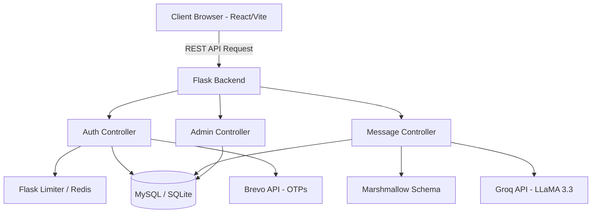

# 💌 Greetly - The AI Greeting Card Generator

*Create the perfect, personalized greeting message in seconds using the magic of LLaMA 3.3.*

---

## ✨ Features
- **AI-Powered Generation**: Instantly craft greeting messages tailored by occasion, tone, and recipient.
- **Secure Authentication**: Robust JWT-based authentication with bcrypt hashing, including OTP-based password recovery.
- **Dynamic Dashboard**: Effortlessly track generated cards, view past history, and mark messages as favorites.
- **Strict Rate Limiting**: Built-in protections against brute-force attacks and quota abuse using Redis.
- **Admin Insights**: Dedicated admin dashboard to view system-wide stats and monitor AI API quota health.

## 🛠 Tech Stack
**Frontend:**
- React 18 + Vite
- TailwindCSS for rapid, responsive styling
- Preact UI Components (Radix UI)
- Lucide React for crisp iconography

**Backend:**
- Python 3 + Flask Application Factory
- SQLAlchemy + MySQL (with robust SQLite fallbacks)
- `marshmallow` for rigorous payload validation
- `flask-bcrypt` for cryptographic security
- `flask-limiter` for API rate-limiting

**Services:**
- **Groq API**: High-speed AI inference (using `llama-3.3-70b-versatile`).
- **Brevo API**: Reliable transactional email delivery for OTPs.

## 📐 Architecture Diagram



## 🚀 Setup Instructions

**1. Clone the Repository:**
```bash
git clone https://github.com/ToshitSai/greetly.git
cd greetly
```

**2. Setup Backend:**
```bash
cd backend
python -m venv venv
source venv/bin/activate  # On Windows: venv\Scripts\activate
pip install -r requirements.txt
```

**3. Setup Frontend:**
```bash
cd ../frontend-v2
npm install
```

**4. Configure Environment Variables:**
Create a `.env` file in the root directory (or inside `backend/`). See the Environment Variables section below for required keys.

**5. Run the Application Local Stack:**
*Start the backend:*
```bash
cd backend
python run.py
```
*Start the frontend (in a new terminal):*
```bash
cd frontend-v2
npm run dev
```
Access the application at `http://localhost:5173`.

## ⚙️ Environment Variables

| Variable | Description | Default / Example |
|----------|-------------|-------------------|
| `FLASK_ENV` | Development or Production mode | `development` |
| `SECRET_KEY` | Key for JWTs and Session security | `your_secret_key` |
| `DATABASE_URI` | External MySQL connection string | `sqlite:///app.db` |
| `REDIS_URL` | Redis URL for Rate Limiting | `memory://` |
| `GROQ_API_KEY` | API key for Groq AI inference | `gsk_...` |
| `BREVO_API_KEY` | API key for transactional emails | `xkeysib-...` |
| `ADMIN_EMAIL` | Credentials for the root Admin user | `admin@greetly.ai` |
| `ADMIN_PASSWORD`| Credentials for the root Admin user | `securepassword` |

## 📡 API Documentation

### 1. **Authentication:** `/api/auth/login` (POST)
Authenticate a user and return a JWT.
**Payload:** `{"email": "user@example.com", "password": "secure123"}`

### 2. **Message Generation:** `/api/messages/generate` (POST)
Generate a new AI greeting message (Requires JWT).
**Payload:**
```json
{
  "customer_id": 1,
  "recipient_name": "Jane",
  "relationship": "Friend",
  "occasion_name": "Birthday",
  "tone_name": "Funny"
}
```

### 3. **Toggle Favorite:** `/api/messages/<id>/favorite` (POST)
Toggle the favorited status of a generated message (Requires JWT).
**Payload:** `{"is_favorite": true}`

### 4. **System Health:** `/api/health` (GET)
Returns the connectivity status and quota health of the upstream AI Provider (Groq). Does not require authentication.
